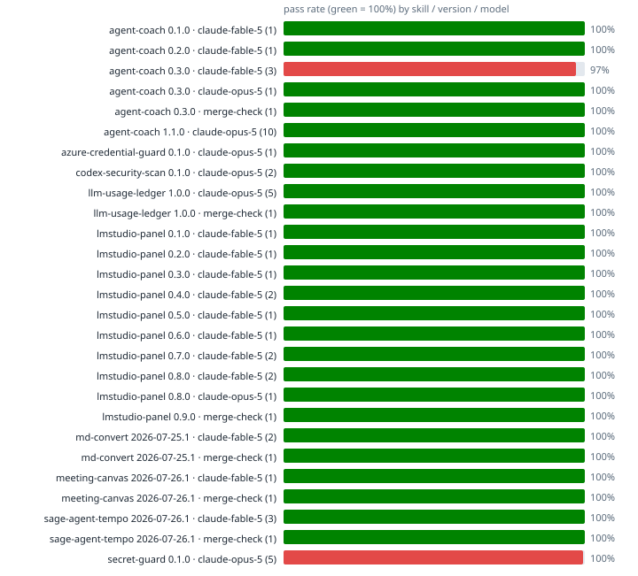

# Skill regression matrix

Auto-rendered from `telemetry/*.jsonl` (append-only run ledgers; each skill's `run_tests.py --auto --model <id>` self-caps at 8 runs per model+version). Regenerate: `python3 telemetry/render_matrix.py`.

| skill | version | model | runs | pass | duration | last run |
|---|---|---|---|---|---|---|
| agent-coach | 0.1.0 | claude-fable-5 | 1 | 100% | 0.02±0.00s | 2026-07-28 |
| agent-coach | 0.2.0 | claude-fable-5 | 1 | 100% | 0.03±0.00s | 2026-07-28 |
| agent-coach | 0.3.0 | claude-fable-5 | 3 | 97% | 0.03±0.00s | 2026-07-28 |
| agent-coach | 0.3.0 | claude-opus-5 | 1 | 100% | 0.14±0.00s | 2026-07-30 |
| agent-coach | 0.3.0 | merge-check | 1 | 100% | 0.03±0.00s | 2026-07-28 |
| agent-coach | 1.1.0 | claude-opus-5 | 10 | 100% | 0.30±0.11s | 2026-08-04 |
| azure-credential-guard | 0.1.0 | claude-opus-5 | 1 | 100% | 0.51±0.00s | 2026-08-09 |
| codex-security-scan | 0.1.0 | claude-opus-5 | 2 | 100% | 0.02±0.00s | 2026-07-29 |
| llm-usage-ledger | 1.0.0 | claude-opus-5 | 5 | 100% | 0.24±0.07s | 2026-08-04 |
| llm-usage-ledger | 1.0.0 | merge-check | 1 | 100% | 0.21±0.00s | 2026-07-28 |
| lmstudio-panel | 0.1.0 | claude-fable-5 | 1 | 100% | 0.15±0.00s | 2026-07-27 |
| lmstudio-panel | 0.2.0 | claude-fable-5 | 1 | 100% | 0.24±0.00s | 2026-07-27 |
| lmstudio-panel | 0.3.0 | claude-fable-5 | 1 | 100% | 0.19±0.00s | 2026-07-27 |
| lmstudio-panel | 0.4.0 | claude-fable-5 | 2 | 100% | 0.24±0.11s | 2026-07-27 |
| lmstudio-panel | 0.5.0 | claude-fable-5 | 1 | 100% | 0.21±0.00s | 2026-07-27 |
| lmstudio-panel | 0.6.0 | claude-fable-5 | 1 | 100% | 0.21±0.00s | 2026-07-27 |
| lmstudio-panel | 0.7.0 | claude-fable-5 | 2 | 100% | 0.26±0.07s | 2026-07-27 |
| lmstudio-panel | 0.8.0 | claude-fable-5 | 2 | 100% | 0.18±0.00s | 2026-07-28 |
| lmstudio-panel | 0.8.0 | claude-opus-5 | 1 | 100% | 0.20±0.00s | 2026-07-28 |
| lmstudio-panel | 0.9.0 | merge-check | 1 | 100% | 0.15±0.00s | 2026-07-28 |
| md-convert | 2026-07-25.1 | claude-fable-5 | 2 | 100% | 0.76±0.27s | 2026-07-25 |
| md-convert | 2026-07-25.1 | merge-check | 1 | 100% | 2.18±0.00s | 2026-07-28 |
| meeting-canvas | 2026-07-26.1 | claude-fable-5 | 1 | 100% | 0.00±0.00s | 2026-07-26 |
| meeting-canvas | 2026-07-26.1 | merge-check | 1 | 100% | 0.00±0.00s | 2026-07-28 |
| sage-agent-tempo | 2026-07-26.1 | claude-fable-5 | 3 | 100% | 0.09±0.01s | 2026-07-28 |
| sage-agent-tempo | 2026-07-26.1 | merge-check | 1 | 100% | 0.10±0.00s | 2026-07-28 |
| secret-guard | 0.1.0 | claude-opus-5 | 5 | 100% | 1.97±0.06s | 2026-07-30 |
